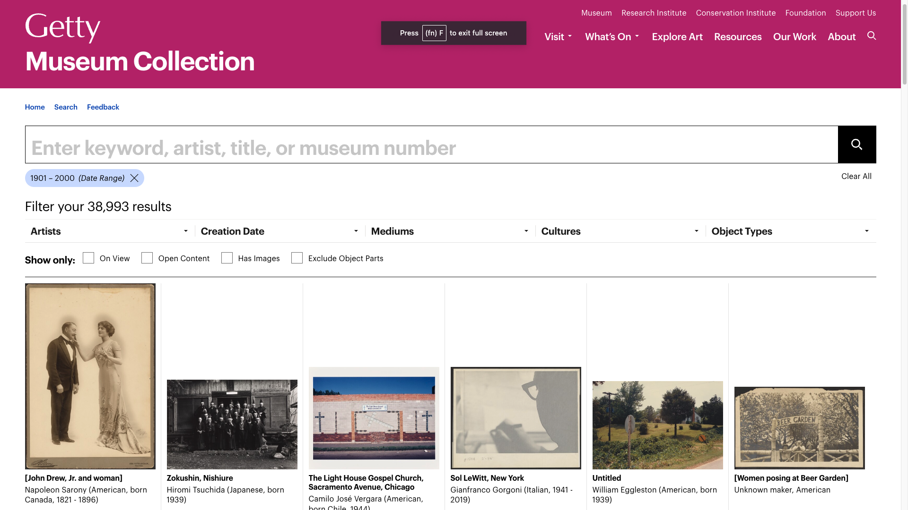
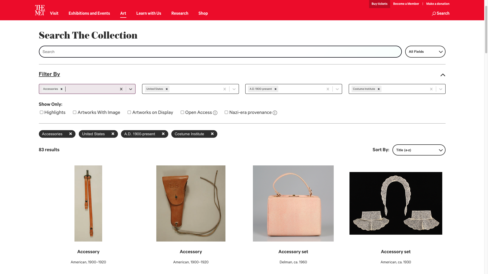
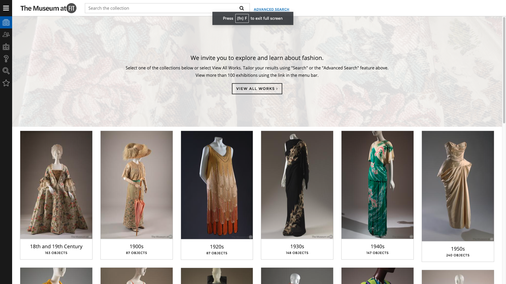
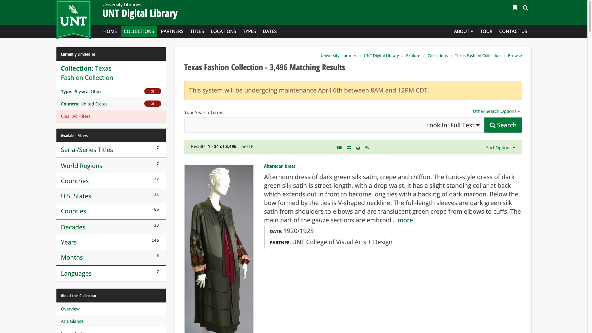
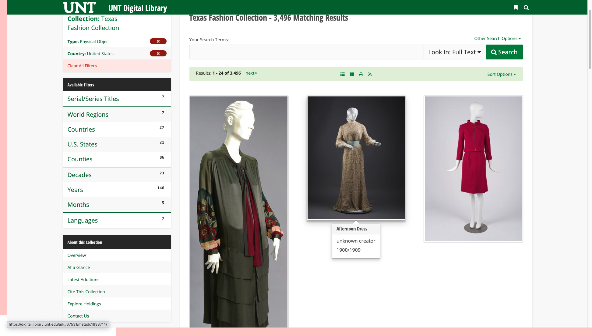

Faceted search augments traditional search techniques with a faceted navigation system, allowing users to narrow down search results by applying multiple filters based on faceted classification of items ([Wikipedia](https://en.wikipedia.org/wiki/Faceted_search)). In the last two decades faceted search has become a staple of web-based user interfaces to digital cultural heritage collections.

This post looks at faceted search interfaces to several major collections, including the Metropolitan Museum of Art and the Museum at FIT, and documents the process of bringing the Paradicms work-search app up to par with other digital collection interfaces.

<!--truncate-->

Faceted search can be used to refine the results of a full-text search, or to filter the entire contents of a database. The screenshot below (click the image to zoom) shows the faceted search interface to the collection at the Getty Museum:

<figure>

<figcaption style={{textAlign: "center"}}>Getty collection interface</figcaption>
</figure>

Most collection interfaces are work-centric, and allow users to filter on faceted metadata about a work. The set of available filters often includes date ranges for a work's creation, a hierarchy of geographical regions, and/or enumerated lists of people associated with works in the collection. More specialized collections may provide correspondingly specialized filters on metadata. For example, a digital costume collection may have metadata about the materials and techniques used in the construction of a work.

### Existing digital collection interfaces

There is a wealth of other examples available online. The sections below show the faceted search interfaces to a few well-known collections of historic garments.

##### [The Metropolitan Museum of Art](https://www.metmuseum.org/art/collection/search)

<figure>

<figcaption style={{textAlign: "center"}}>Metropolitan Museum of Art collection interface</figcaption>
</figure>

The Met provides a uniform interface to its entire collection. The Met's interface is representative of the state of the art for museums, and includes:

* a fulltext search bar at the top of the page, with dropdown options for searching all fields in the collection database or a subset of them
* an inline filters panel with compact select boxes that autocomplete from large enumerated lists
* a few special filters (Highlights, Artworks With Image, et al.) broken out as checkboxes
* badges indicating the set of currently-applied filters
* a dropdown for selecting different sort fields and orders
* minimal information about each search result (work): image, title, origin, and approximate dates 

The screenshot shows the works in the Met's collections filtered by type (Accessories), geographical region (United States), date range (A.D. 1900-present), and department (Costume Institute).

##### [The Museum at FIT](https://fashionmuseum.fitnyc.edu/collections)

<figure>

<figcaption style={{textAlign: "center"}}>Museum @ FIT collection interface: collections</figcaption>
</figure>

The Museum @ FIT's collection interface invites the user to select a subset of works ("collections") before seeing any of them. Alternatively, the user can view all works in the museum's collection.

Choosing a subset such as works from the 1920s takes the user to the primary faceted search screen:

<figure>

<figcaption style={{textAlign: "center"}}>Museum @ FIT collection interface: objects</figcaption>
</figure>

The interface is similar to the Met's faceted search, except for the way filters are displayed. In order to filter the current search results, the user must click a Filter button
which pops out a sidebar (shown). The filters for such as Designer comprise lists of field values found in works that matched the search, with each list ordered from most to least frequent value.

##### [Texas Fashion Collection](https://digital.library.unt.edu/explore/collections/TXFC/browse/)

<figure>

<figcaption style={{textAlign: "center"}}>Texas Fashion Collection interface: list view</figcaption>
</figure>

The Texas Fashion Collection interface is visually distinct from those of the Met and the Museum at FIT. The default list view of the search results includes a relatively large image, the work's title, a long description, an approximate date, and provenance information. Users can select an alternative grid view, shown below, which displays large images. In the grid view the user must hover over an image to see its metadata:

<figure>

<figcaption style={{textAlign: "center"}}>Texas Fashion Collection interface: grid view</figcaption>
</figure>

Facet filters in the Texas Fashion Collection interface are listed in a sidebar panel, but selecting a filter pops up a modal dialog that lists facet values by descending frequency:

<figure>

<figcaption style={{textAlign: "center"}}>Texas Fashion Collection interface: filter</figcaption>
</figure>

### Commercial interfaces

Companies such as [Airbnb](https://www.airbnb.com/) that rely on the user experience of their websites to drive revenue set the standard for faceted search interfaces. The screenshot below shows Airbnb's interface:

<figure>

<figcaption style={{textAlign: "center"}}>Airbnb home page</figcaption>
</figure>

The most important filters -- time range, number of guests, and listing category -- are given space at the top of the page. The filter for listing categories such as Beachfront and Mansions is an attractive ribbon of icons. Others filters can be accessed by clicking on the Filters button, which pops up a modal dialog:

<figure>

<figcaption style={{textAlign: "center"}}>Airbnb pop-up filters</figcaption>
</figure>

Unlike the digital collection interfaces, Airbnb customizes the filters on a per-field basis. There are range filters (price), value filters (bedrooms), checkboxes (Type of place), and so on.

### The Paradicms work search app

The [Paradicms work search app](https://paradicms.org/docs/reference/apps/#work-search) provides a faceted and fulltext search interface over the set of [works](https://paradicms.org/docs/introduction/data-model/) in a digital collection. The app can be configured to facetize, filter, and search arbitrary domain-specific properties of works, such as the condition of a garment (as defined by [Costume Core](http://www.ardenkirkland.com/costumecore/)).

The flexibility of this approach presents some challenges. In contrast to interfaces like Airbnb's, which can always assume the presence of certain metadata like price and location, the Paradicms work search app assumes that most properties are optional. Supporting arbitrary properties means the system must also support dynamic configuration of the user interface. Some properties may be fulltext searchable but not filterable. Some properties may require range instead of value filters.

The screenshot below shows the initial state of the interface, before making any improvements:

<figure>

<figcaption style={{textAlign: "center"}}>Paradicms work search app before improvements</figcaption>
</figure>

* The navbar contains a search box for fulltext search. If the user doesn't enter a query, the faceted search interface starts from all works in the collection.
* Filters for various user-defined properties are shown in an inline sidebar, with an accordion that ensures that only one filter is visible at a time.
* There is only one type of filter, on values. A value filter is modified by checking and unchecking boxes rows in a table of facet values. The first row is always "Unknown", indicating works that do not have a value for the associated property.
* Works are displayed in a gallery of cards. Each card contains the work title, references to pages associated with the work, an image, and attribution for the image. Image attribution is included by default, since the app does not assume that the owner of the site also owns the image rights. That's a point of divergence from most digital collections, like the ones at the Met and the Museum at FIT, which own the rights to the images they display and don't have to include attribution.
* The gallery has standard pagination and a sort dropdown with common options.

### Areas of improvement

Compared to the faceted search interfaces of the Met, the Museum at FIT, and the Texas Fashion Collection -- which have similar functionality -- the Paradicms work search app lacks polish and finesse. It looks like it was designed and built by a software engineer as an 80% solution -- because it was. Unfortunately, the remaining 20% is the difference between a clunky user interface and a good one.

We can do better. Our goal is to close the gap between the current interface and other digital collection interfaces, like the Met's. In the sections below we'll walk through improvements to the app. We won't alter the basic functionality of the faceted search interface, only how it is presented. We'll start with high-impact, low-effort changes and go from there.

##### Limit gallery card information to the essentials

Move inessential information like Wikipedia links out of the card headers and on to the pages for each work. Add an approximate date to each card.

<figure>
<figcaption style={{textAlign: "center"}}>Before</figcaption>

</figure>

<figure>
<figcaption style={{textAlign: "center"}}>After</figcaption>

</figure>

##### Standardize gallery card layout and dimensions

Why is it bad?
What does it do?

"After" screenshot of Paradicms

##### Pop-up filters

Filters on work type, associated time and place, and sub-collection are the essence of the faceted search interface. These can be shown inline, as on the Texas Fashion Collection site, or as a pop-up, as on the Met's collection interface. Pop-up filters like Airbnb's (shown below) seem to have become the more popular choice in recent years.

Maximize real estate for results

"After" screenshot of Paradicms

#### Remove gratuitous whitespace

Too much whitespace

"After screenshot of Paradicms"

#### Specialize filters

??

### Conclusion

