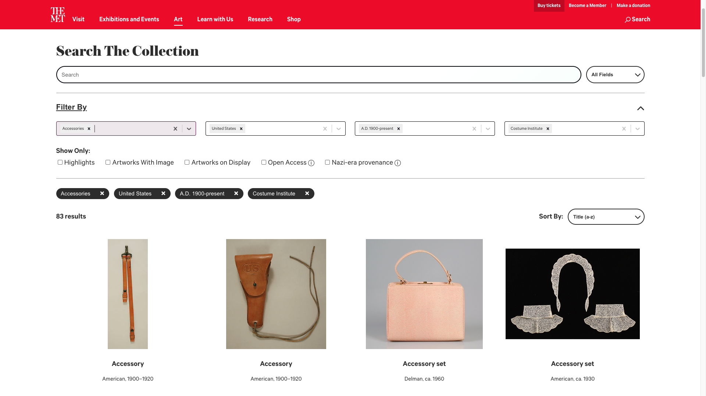
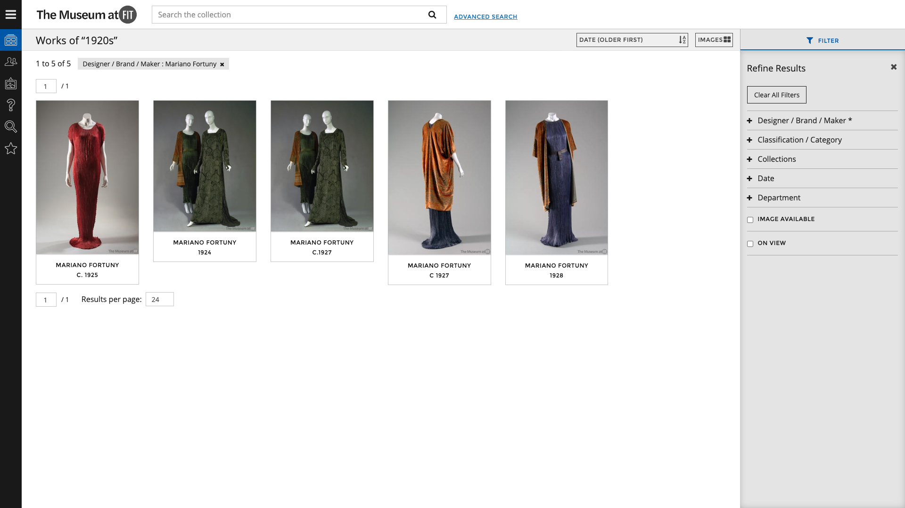
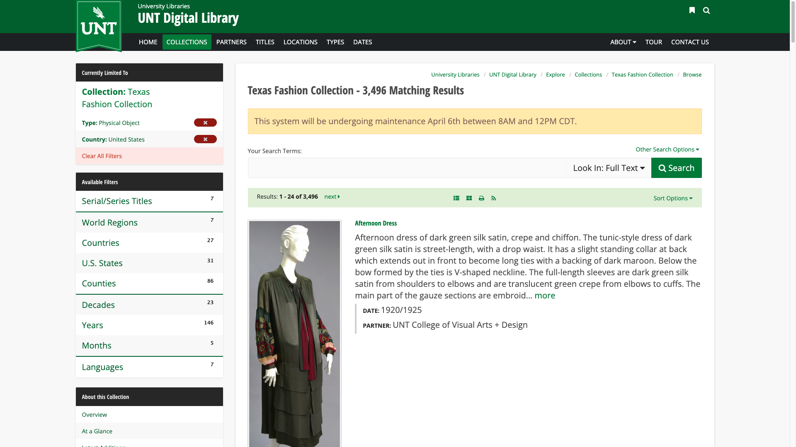
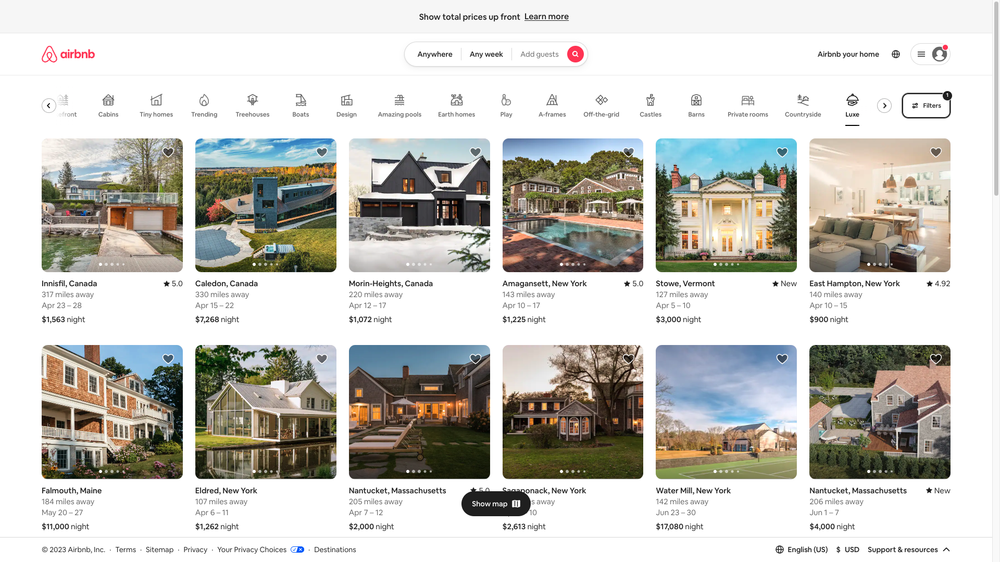
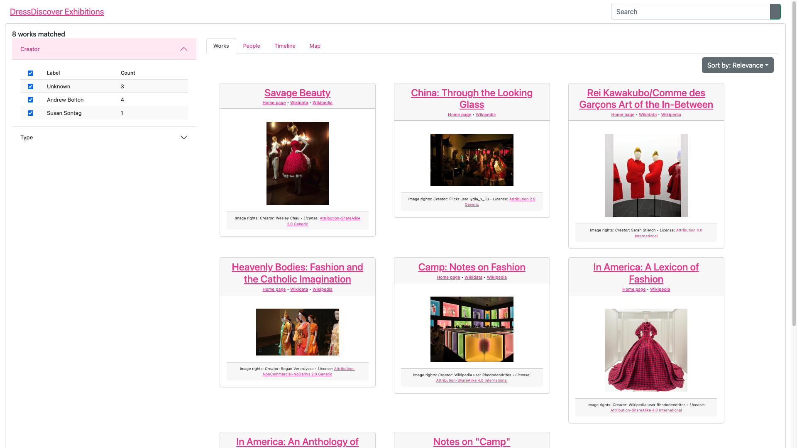
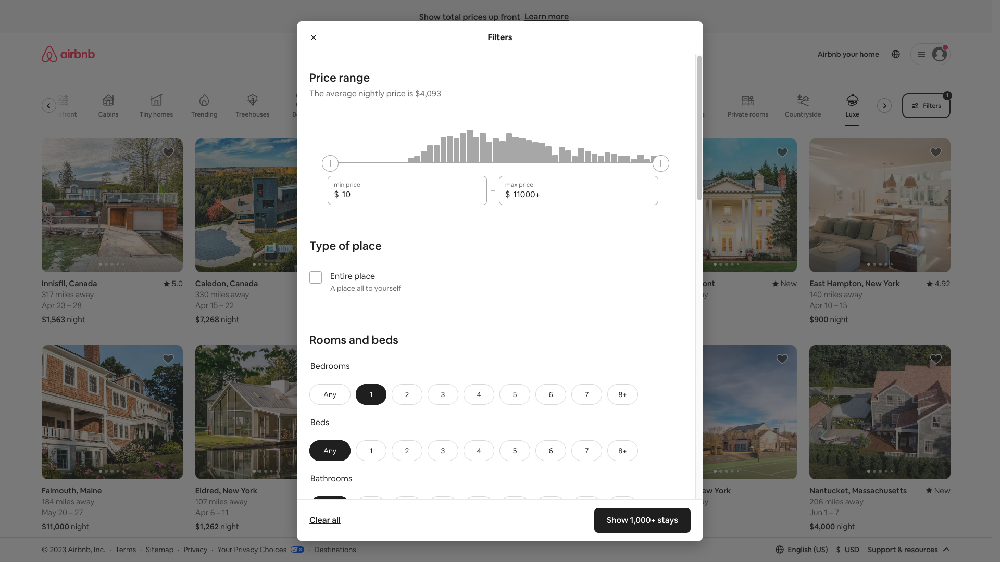

Cautionary tale about (back end) engineers and user interfaces

Other summary text

<!--truncate-->

### The Paradicms work search app

The [Paradicms work search app](https://paradicms.org/docs/reference/apps/#work-search) provides a faceted and full-text search interface over a set of [Works](https://paradicms.org/docs/introduction/data-model/). The app can be configured to facetize, filter, and search arbitrary domain-specific Work properties such as [Costume Core]([Costume Core](http://www.ardenkirkland.com/costumecore/) condition.

Its primary uses are:

* requirement 1
* requirement 2

The genericness is a liability..

### Precedents

Fortunately there is a wealth of examples of how to do faceted search in cultural heritage collections

Screenshotted a few historic costume collections

##### [The Metropolitan Museum of Art](https://www.metmuseum.org/art/collection/search)

##### [The Museum at FIT](https://fashionmuseum.fitnyc.edu/collections)

##### [Texas Fashion Collection](https://digital.library.unt.edu/explore/collections/TXFC/browse/)

##### [Airbnb](https://www.airbnb.com/)

Even the best museum interfaces are not quite up to the standard of big companies like Airbnb, which rely on the user experience of their sites to drive revenue.

### The status quo

Describe the interface:
Search in the navbar
Inline filters in a sidebar
Default gallery view

### Areas of improvement

Would like to bring this into line with a modern faceted search interface.

##### Minimize information on the cards

"After" screenshot of Paradicms

##### Standardize card layout and dimensions

Why is it bad?
What does it do?

"After" screenshot of Paradicms

#### Pop-up filters

Filters on work type, associated time and place, and sub-collection are the essence of the faceted search interface. These can be shown inline, as on the Texas Fashion Collection site, or as a pop-up, as on the Met's collection interface. Pop-up filters like Airbnb's (shown below) seem to have become the more popular choice in recent years.

Maximize real estate for results

"After" screenshot of Paradicms

#### Remove gratuitous whitespace

Too much whitespace

"After screenshot of Paradicms"

#### Specialize filters

??

### Conclusion

The new Paradicms 