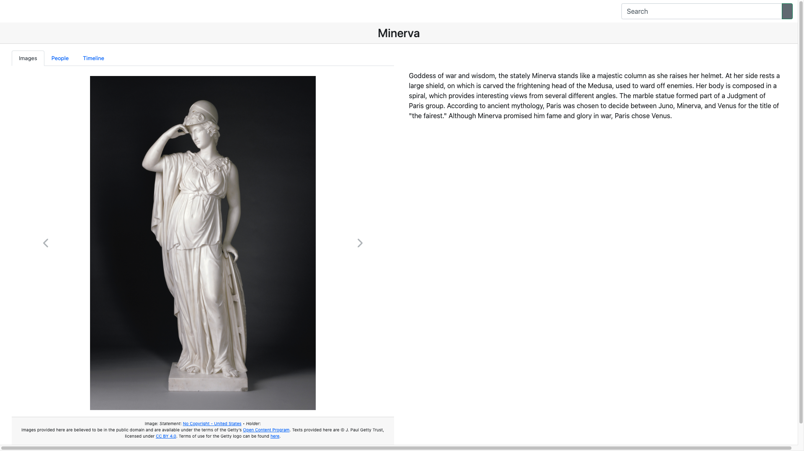

import GettyIiifPresentationApiManifestJsonLd from "./_getty_iiif_presentation_api_manifest.jsonld.md";
import GettyIiifPresentationApiManifestTtl from "./_getty_iiif_presentation_api_manifest.ttl.md";
import GettyLinkedArtHumanMadeObjectJsonLd from "./_getty_linked_art_human_made_object.jsonld.md";
import GettyLinkedArtHumanMadeObjectTtl from "./_getty_linked_art_human_made_object.ttl.md";
import LinkedArtDocumentationHumanMadeObjectJsonLd from "./_linked_art_documentation_human_made_object.jsonld.md";
import LinkedArtDocumentationHumanMadeObjectTtl from "./_linked_art_documentation_human_made_object.ttl.md";

[Getty](https://www.getty.edu/) provides [public access to much of their collection data via APIs](https://data.getty.edu/). Getty collection data are encoded in [Linked Art](https://linked.art), a [Linked Open Data](https://en.wikipedia.org/wiki/Linked_data) model which is used to describe cultural heritage materials. Getty image metadata is encoded using [IIIF](https://iiif.io/), a set of open standards for delivering high-quality, attributed digital objects online at scale.

This post documents the process of integrating Getty collection data and images into [Paradicms apps](/docs/reference/apps).

<!--truncate-->

### Looking at the data

Much of Getty's collection metadata is licensed under a [Creative Commons Attribution 4.0 International License](http://creativecommons.org/licenses/by/4.0/). Getty's [Open Content Program](https://www.getty.edu/projects/open-content-program/) makes images from Getty's collections freely available for non-commercial purposes, and many Getty images are in the public domain. You can find Open Content collection data with images by [searching the collection](https://www.getty.edu/art/collection/search) and clicking the _Show only_ checkboxes next to _Open Content_ and _Has Images_.

A [Getty collection record about a statue of Minerva](https://www.getty.edu/art/collection/object/103RRE) was used as a driving test case during the process of integrating Getty data and images into Paradicms apps:

<iframe src="https://www.getty.edu/art/collection/object/103RRE" style={{minHeight: "50vh", width: "100vh"}} />

#### JSON-LD

At the bottom of the collection interface page, in the _APIs & other identifiers_ section, there are links to [the record's REST API URL](https://data.getty.edu/museum/collection/object/4d302ecd-f3a5-4e52-9e97-ca3ca8d5c9e6) and [IIIF Presentation API manifest URL](https://media.getty.edu/iiif/manifest/9ab53ead-ad00-460c-ab86-559cfd4d839c).

An HTTP GET request for the record's REST API URL returns [JSON-LD](https://json-ld.org/) that conforms to the Linked Art data model:

    
Getty entity record in JSON-LD

    <GettyLinkedArtHumanMadeObjectJsonLd/>

Another HTTP GET request for the IIIF Presentation API manifest URL returns JSON-LD for the manifest:

    
Getty IIIF Presentation API manifest in JSON-LD

    <GettyIiifPresentationApiManifestJsonLd/>

#### Turtle

Linked Art clients such as [linkedart.js](https://linkedartjs.org/) usually manipulate Linked Art JSON-LD as JSON. JR Ladd's excellent series of blog posts on ["Understanding Linked Art With the Getty Collection API"](https://observablehq.com/@jrladd/linked-art-1) demonstrates how to use the linkedart.js client to navigate Getty collection data as JSON.

Paradicms takes a different approach, converting data to RDF as close to the source as possible and using RDF in user-facing applications -- [end-to-end](/blog/2023-07-12-ld4-2023).

[Expanding](https://www.w3.org/TR/json-ld11-api/#expansion) the Getty entity record JSON-LD from the listing above produces the following semantically equivalent RDF in Turtle syntax:

    
Getty entity record in Turtle

    <GettyLinkedArtHumanMadeObjectTtl/>

The IIIF Presentation API manifest can also be converted to Turtle:

    
Getty IIIF Presentation API manifest in Turtle

    <GettyIiifPresentationApiManifestTtl/>

#### Observations

The Turtle-syntax rendering of the entity record puts statements about the top-level record IRI (`https://data.getty.edu/museum/collection/object/4d302ecd-f3a5-4e52-9e97-ca3ca8d5c9e6`) front-and-center:

* The entity is a `crm:E22_Human-Made_Object`. Linked Art adopts much of its conceptual data model from the [CIDOC CRM](https://www.cidoc-crm.org/). The `crm` namespace is documented in ["Implementing the CIDOC Conceptual Reference Model in RDF"](https://cidoc-crm.org/Resources/implementing-the-cidoc-conceptual-reference-model-in-rdf), which differs from the [Erlangen CRM / OWL implementation of CIDOC CRM](http://erlangen-crm.org/current-version).
* The entity is the `crm:P129i_is_subject_of` its associated [IIIF Presentation API manifest](https://media.getty.edu/iiif/manifest/9ab53ead-ad00-460c-ab86-559cfd4d839c).
* The record contains an abundance of interesting metadata, much of which is displayed on the user-visible collection page.

The Turtle syntax also highlights syntactic differences between Getty's Linked Art representation and the examples in the [Linked Art data model documentation](https://linked.art/model/). The  latter more closely resembles idiomatic JSON, as in [this example of a `HumanMadeObject`](https://linked.art/model/object/physical/):

    
Linked Art documentation <code>HumanMadeObject</code> in JSON-LD

    <LinkedArtDocumentationHumanMadeObjectJsonLd/>

Converting the documentation JSON-LD to Turtle produces the following:

    
Linked Art documentation <code>HumanMadeObject</code> in Turtle

    <LinkedArtDocumentationHumanMadeObjectTtl/>

Note the presence of blank nodes, which are absent from the Getty metadata. Avoiding blank nodes makes it easier to de- and re-serialize RDF consistently.

### Implementing a Getty enrichment process

Paradicms uses [enrichment processes](/docs/reference/enrichment) to automatically integrate metadata and images from external sources into Paradicms apps.

An enrichment process for Getty collection data and images should:
1. recognize `sameAs` connections from existing Paradicms collection data to entities in the Getty collection
2. download collection and image metadata for connected Getty entities using Getty's REST endpoints and IIIF Presentation API
3. incorporate the metadata into [Paradicms apps](/docs/reference/apps) by treating Linked Art as an additional [logical data model](/docs/reference/logical-data-models/)

Steps 1 and 2 are implemented in a Python-based enrichment process, while step 3 is implemented in TypeScript as a set of [RDF-backed models](/blog/2023-06-07-rdf-backed-models-in-typescript).

#### Enrichment in Python

The new `GettyEnricher` class in Python recognizes `sameAs` RDF statements in existing Paradicms collection data (from e.g., a [spreadsheet](/docs/reference/spreadsheet-format)) where the object of a statement is an [IRI](https://en.wikipedia.org/wiki/Internationalized_Resource_Identifier) that resolves to a Getty REST endpoint. According to [Getty's documentation](https://data.getty.edu/museum/collection/docs/), Getty entity IRIs have the form `https://data.getty.edu/museum/collection/<ENTITY_TYPE>/<ENTITY_ID>`, where `ENTITY_TYPE` can be `object`, `place`, `document`, `group`, `person`, `exhibition`, or `activity`. In the record shown above, `object` corresponds to a Linked Art `crm:E22_Human-Made_Object`.

After recognizing a Getty REST API URL like [`https://data.getty.edu/museum/collection/object/4d302ecd-f3a5-4e52-9e97-ca3ca8d5c9e6`](https://data.getty.edu/museum/collection/object/4d302ecd-f3a5-4e52-9e97-ca3ca8d5c9e6), the Python enricher downloads the Linked Art JSON-LD for that entity using an HTTP GET request. The enricher then converts the JSON-LD to an RDF graph using [`rdflib`](https://rdflib.readthedocs.io/en/stable/).

The Getty REST API URL is also the IRI of the top-level `crm:E22_Human-Made_Object`. The enricher follows connections in the `rdflib` `Graph` from this IRI to other resources in order to identify the license and rights statements of the metadata, including the object's description. The RDF also contains references to images that represent the object in digital form, but the enricher bypasses these references in favor of retrieving more comprehensive image metadata from the IIIF Presentation API manifest.

The enricher extracts metadata from Getty's APIs but does not transform them in any way. The Python code only needs to parse enough of the Linked Art and IIIF RDF to ensure that all referenced metadata (about e.g., images, licenses, rights statements) have been extracted and included for downstream consumption by Paradicms apps.

#### Linked Art in Paradicms apps

From the perspective of [Paradicms apps](/docs/reference/apps), Linked Art RDF can be treated as an additional [logical data model](/docs/reference/logical-data-models):

| RDF type                    | TypeScript logical data model class | TypeScript conceptual data model interface |
|-----------------------------|-------------------------------------|--------------------------------------------|
| `crm:E12_Production`        | `LinkedArtProduction`               | `WorkCreationEvent`                        |
| `crm:E21_Person`            | `LinkedArtPerson`                   | `Person`                                   |
| `crm:E22_Human-Made_Object` | `LinkedArtHumanMadeObject`          | `Work`                                     |
| `crm:E33_Linguistic_Object` | `LinkedArtLinguisticObject`         | `Text`                                     |

Not all Linked Art logical data model classes are represented in the Paradicms conceptual data model. Some, like `LinkedArtTimeSpan`, serve as bridges between other models that are represented.

`dcmitype:Image`s from the IIIF Presentation API RDF are already part of the Dublin Core logical data model and are wrapped in a `DcImage` TypeScript instance.

[Creative Commons](https://creativecommons.org/ns) and [RightsStatements.org](https://github.com/rightsstatements/data-model) references are included as `CreativeCommonsLicense` and `RightsStatementsDotOrgRightsStatement` implementations, respectively.

### Conclusion

The enrichment process recognizes `sameAs` connections to Getty collection IRIs, extracts Linked Art and IIIF Presentation API RDF from the Getty APIs, and passes the RDF as-is to Paradicms apps. The abstraction of the conceptual data model and the use of [RDF-backed logical models in TypeScript]((/blog/2023-06-07-rdf-backed-models-in-typescript)) allows apps to be agnostic of the underlying details of the RDF while seamlessly incorporating Getty collection metadata and images into a user interface:

