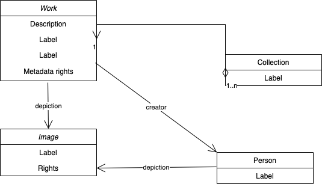

# Conceptual data model

The Paradicms [conceptual data model](https://en.wikipedia.org/wiki/Conceptual_schema) is designed to cover the core elements of a digital collection, such as images and works, while being flexible on how the elements are represented in logical data models. The diagram below shows the core classes in the model:

Paradicms adapts the essential structure and nomenclature of its conceptual data model from [VRA Core](https://www.loc.gov/standards/vracore/), a data standard for the description of images and works of art and culture.  There are three primary entities in VRA Core 4.0:
* `Work`: a built or created object
* `Collection`: an aggregate of `Work`s 
* `Image`: a visual surrogate of a `Work`

The basic `Work`-`Collection`-`Image` model can accommodate a wide range of externally-sourced collection data with compatible structures, such as [Linked Art](https://linked.art/),
[schema.org](https://schema.org/), [Wikidata](https://wikidata.org/), and [Omeka Classic](https://omeka.org/classic/) items/files/elements/element sets. The model is abstract enough to permit for multiple logical data models, typically in the form of RDF ontologies. The [Paradicms logical data models](/docs/reference/logical-data-models) reference documents supported representations.

Beyond the primary entities, the Paradicms conceptual data model incorporates a few other elements of VRA Core 4.0, such as agents (people and organizations), as well as concepts from several other standards:

* A model of `Work`-related events inspired by [CIDOC CRM](https://www.cidoc-crm.org/)
* [The Creative Commons Rights Expression Language](https://creativecommons.org/ns) for describing copyright licenses
* [The RightsStatements.org data model](https://github.com/rightsstatements/data-model) describing interoperable rights statements
* The [SKOS Simple Knowledge Organization System](https://www.w3.org/2004/02/skos/) model for controlled vocabularies
* [The Time Ontology in OWL](https://www.w3.org/TR/owl-time/) for partial date-time descriptions
