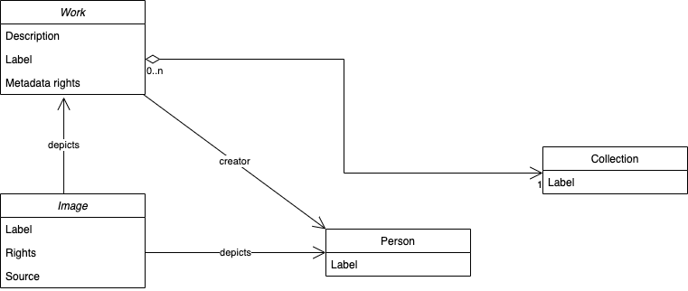

# Data model

The Paradicms data model is designed to capture the core elements of a digital collection, such as images and works, while being flexible on how the elements are described in detail. The diagram below shows the core classes in the data model:

The [data model reference](/docs/reference/data-model) provides a full list of classes and their properties.

### Structure

Paradicms adapts the essential structure and nomenclature of its data model from [VRA Core](https://www.loc.gov/standards/vracore/), a data standard for the description of images and works of art and culture.

There are three primary entities in the VRA Core 4.0 data model:
* `Work`, which is a built or created object
* `Collection`, which is an aggregate of `Work`s 
* `Image`, which is a visual surrogate of a `Work`

Beyond the primary entities, the Paradicms data model incorporates a few other aspects of VRA Core 4.0, such as agents (people and organizations). Where VRA Core was insufficient, Paradicms adapts concepts from other models:

* A model of `Work`-related events inspired by [CIDOC CRM](https://www.cidoc-crm.org/)
* [The Creative Commons Rights Expression Language](https://creativecommons.org/ns) for describing copyright licenses
* [The RightsStatements.org data model](https://github.com/rightsstatements/data-model) describing interoperable rights statements
* The [SKOS Simple Knowledge Organization System](https://www.w3.org/2004/02/skos/) model for controlled vocabularies
* [The Time Ontology in OWL](https://www.w3.org/TR/owl-time/) for partial date-time descriptions

### Properties

The Paradicms data model diverges from VRA Core in its use of different vocabularies for describing the properties of works, collections, images, agents, et al. The XML-based VRA Core was designed to be self-contained, with minimal reuse of third party elements. In contrast, Paradicms reuses established vocabularies wherever possible. These include:

* [Basic Geo Vocabulary](https://www.w3.org/2003/01/geo/) for WGS84 latitude and longitude properties
* [DCMI Metadata Terms](https://www.dublincore.org/specifications/dublin-core/dcmi-terms/) (aka Dublin Core Terms) for generic properties such as a `Work`s `title`.
* [Costume Core](http://www.ardenkirkland.com/costumecore/) for properties that encode the structure of historic clothing `Work`s
* [An Exif vocabulary](https://www.w3.org/2003/12/exif/) for basic `Image` metadata such as `height` and `width`
* [The FOAF Vocabulary](http://xmlns.com/foaf/0.1/) for properties about people and organizations

as well as properties from the Creative Commons Rights Expression Language, the RightsStatement.org data model, SKOS, and the Time Ontology. 

VRA Core 4.0 [has been translated to an RDF ontology](http://purl.org/vra/) for use in Linked Data systems like Paradicms. The latter reuses a number of properties from the VRA Core RDF ontology in order to describe aspects of cultural heritage artifacts, including a `Work`'s `culturalContext`, `material`, and `technique`. 

The Paradicms data model defines custom properties where absolutely necessary. For example, configuration files for the static site generation system rely on a bespoke RDF vocabulary that is highly specific to Paradicms.

### Mapping

The Paradicms data model strikes a pragmatic middle ground between context-independent vocabularies like Dublin Core and highly prescriptive systems like CIDOC CRM. The basic `Work`-`Collection`-`Image` structure can accommodate a wide range of externally-sourced collection data with compatible structures, such as
[schema.org](https://schema.org/), [Wikidata](https://wikidata.org/), and Omeka Classic items/files/elements/element sets.

The data model is also relatively flat, with few properties requiring nested data structures like lists and sub-objects. That makes it easier to populate the model with data from spreadsheets and other tabular sources.