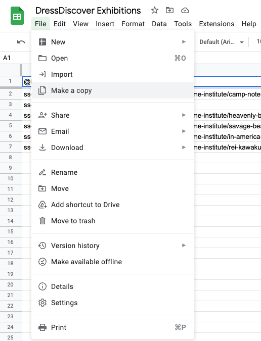
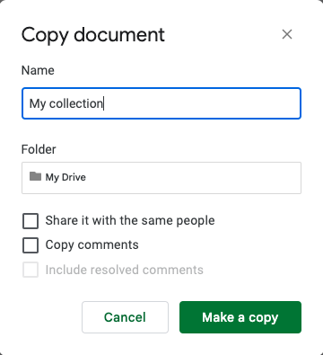
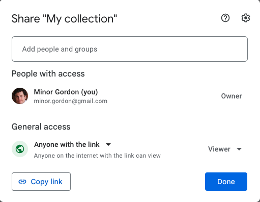

# Recipe: create a Google Sheet for your collection data

The following steps assume you have created a Google account and are logged in to it.

### Copy the template Google Sheet

Create a new Google Sheet by copying [this template](https://docs.google.com/spreadsheets/d/1j2oaMvMxY4pnXO-sEH_fky2R2gm6TQeIev_Q8rVOD4M/edit?usp=sharing).

### Name the copy

We'll call the copy "My collection" and save it in your Google Drive. Leave the *Share it with the same people* and *Copy comments* boxes unchecked. When you're done typing the name of the copy, click *Make a Copy*.

### Share the new Google Sheet

You will need to make your new Google Sheet publicly available to anyone with the link:

1. Click the *Share* button in the upper right-hand corner
2. Change the *General access* dropdown to *Anyone with the link* and leave it as *Viewer*.
3. Click the *Done* button.

