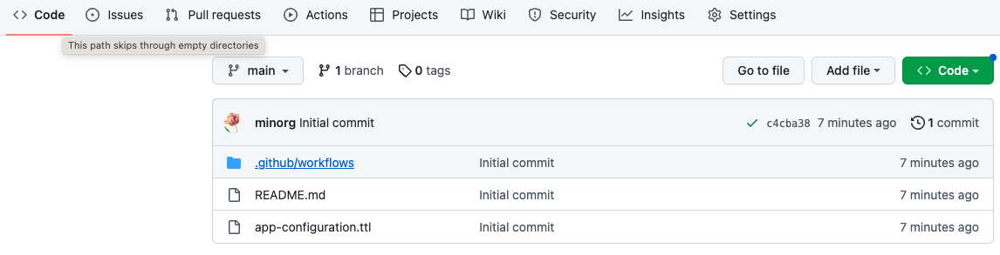
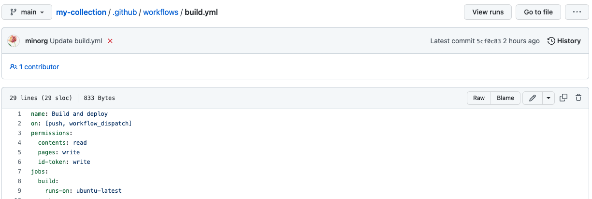
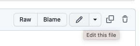

# Recipe: edit the configuration of a Paradicms GitHub Action static site generation workflow

### Navigate to the "Code" tab on your GitHub repository

### Select the `.github/workflows` folder

### Select the `build.yml` file

### Edit the file by clicking the pencil button.

### Edit the YAML as needed

### Commit changes

When you are done editing, click the "Start commit" button on the right, then the "Commit changes" button.

