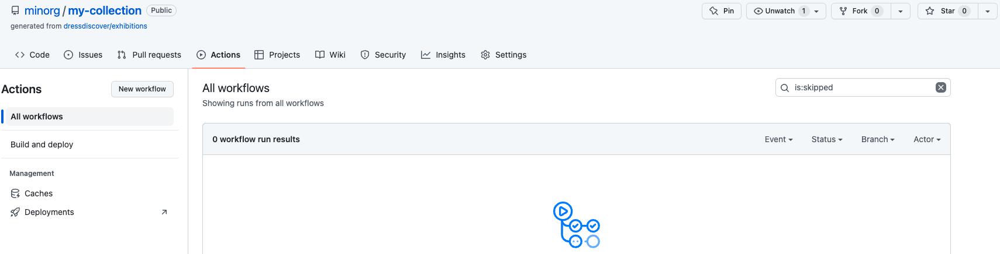

# Recipe: manually run a Paradicms GitHub Action static site generation workflow

### Navigate to the *Actions* tab on your GitHub repository

### Select the *Build and deploy* action in the left sidebar

### Run the workflow

Click the *Run workflow* button on the right. You don't need to change the *Use workflow* branch. Simply click the *Run workflow* button.

You will see a new workflow run like the following:

GitHub is using Paradicms to generate a website from your data. You will *Run workflow* to re-generate the site whenever you change your data.

Once the workflow has completed, the status icon beside it will turn into a green checkmark.

