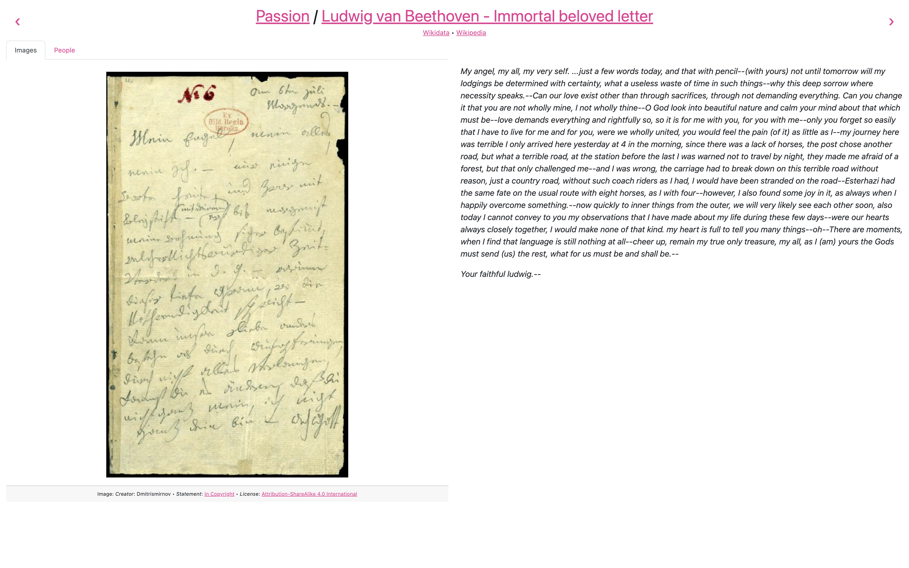
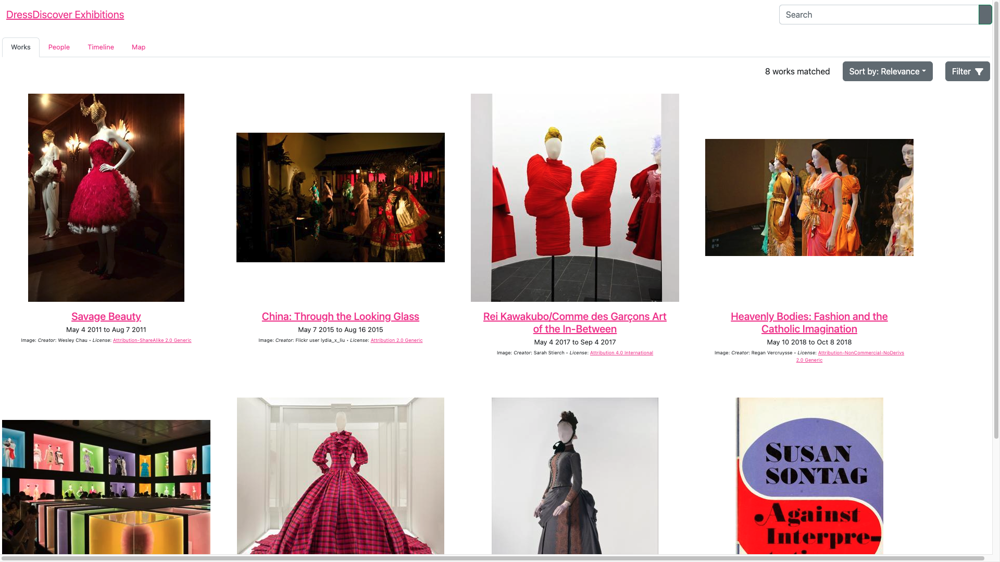

# Reference: apps

This page documents the apps currently available in Paradicms, with one section per app.

### `multi-page-exhibition`

The `multi-page-exhibition` app displays the `Work`s in a dataset in a sequence of multiple web pages the user can click through.

### `single-page-exhibition`

The `single-page-exhibition` app displays the `Work`s in a dataset in a vertical sequence on one web page the user can scroll through.

### `work-search`

The `work-search` app provides a faceted and full-text search interface over a set of `Work`s. The app can be [configured](../app-configuration.md) to facetize, filter, and search arbitrary domain-specific `Work` properties such as [Costume Core](http://www.ardenkirkland.com/costumecore/) `condition`.

