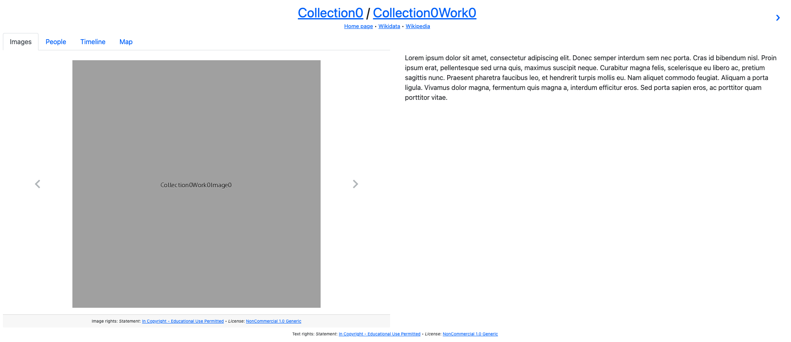
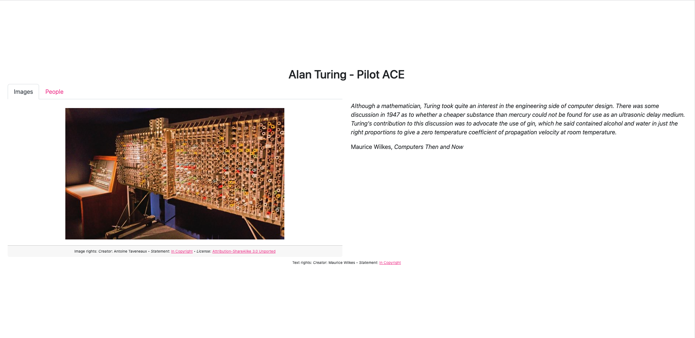
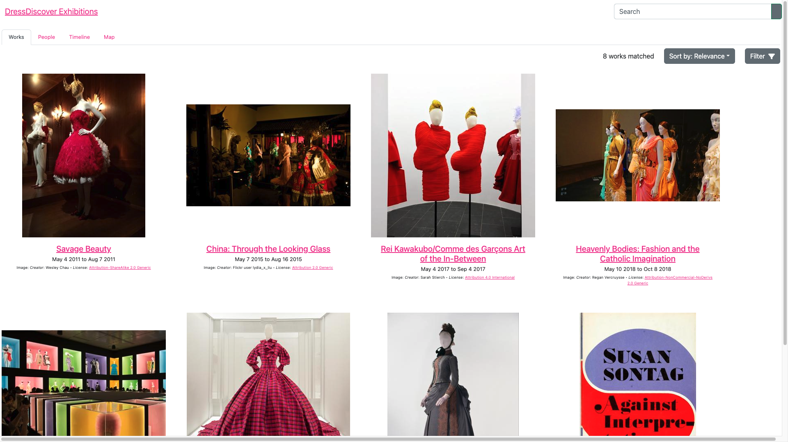

import AirtableGitHubTemplateRepositoryLink from "@site/src/components/AirtableGitHubTemplateRepositoryLink";

# Reference: apps

This page documents the apps currently available in Paradicms, with one section per app.

### `multi-page-exhibition`

The `multi-page-exhibition` app displays the `Work`s in a dataset in a sequence of multiple web pages the user can click through.

* [Demo site](https://passion.bildungsroman.minorgordon.net)
* [GitHub repository](https://github.com/minorg-Bildungsroman/Passion)
* [Dataset (in Paradicms directory format)](https://github.com/minorg-Bildungsroman/Passion)

### `single-page-exhibition`

The `single-page-exhibition` app displays the `Work`s in a dataset in a vertical sequence on one web page the user can scroll through.

* [Demo site](https://thinker-doer.bildungsroman.minorgordon.net)
* [GitHub repository](https://github.com/minorg-Bildungsroman/Thinker-Doer)
* [Dataset (in Paradicms directory format)](https://github.com/minorg-Bildungsroman/Thinker-Doer)

### `work-search`

The `work-search` app provides a faceted and full-text search interface over a set of `Work`s. The app can be [configured](/docs/reference/app-configuration) to facetize, filter, and search arbitrary domain-specific `Work` properties such as [Costume Core](http://www.ardenkirkland.com/costumecore/) `condition`.

* [Demo site](https://costumecoretemplate.dressdiscover.org/)
* <AirtableGitHubTemplateRepositoryLink>GitHub repository</AirtableGitHubTemplateRepositoryLink>
* [Dataset (in Airtable)](https://airtable.com/shryU3j5IXFxjrdEy)

### `worksheet`

The worksheet consists of a series of screens, with different features depending on the type of object. Features are grouped into feature sets. For example, clothing can be described in terms of material, neckline, sleeve type, and so on.

Features are defined by `Property`'s in the [Paradicms ontology](/docs/reference/ontology). Feature sets are defined by `PropertyGroup`'s. The choices available for each feature correspond to `Concept`'s in the range of the feature's `Property`.

* [Demo site](https://worksheet.dressdiscover.org)
* [GitHub repository](https://github.com/dressdiscover/worksheet)
* [Dataset (in Airtable)](https://airtable.com/appS5bN4hk1aWEzE0/tblvgw66SMo5lDgS4/viwW1AA0vZqFKmiad?blocks=hide)
