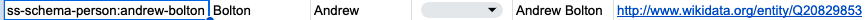
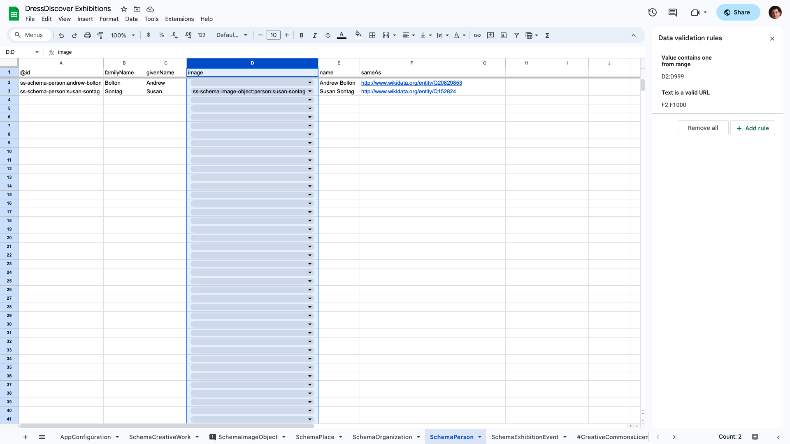

# Reference: spreadsheet format

This page documents the format of spreadsheets (in Google Sheets, Excel, et al.) for storing Paradicms collection data.


### Spreadsheet structure

A Paradicms-formatted spreadsheet such as the [Google Sheets template](https://docs.google.com/spreadsheets/d/1j2oaMvMxY4pnXO-sEH_fky2R2gm6TQeIev_Q8rVOD4M/edit#gid=0) consists of multiple sheets. Each sheet corresponds to a class in the [Paradicms ontology](/docs/reference/ontology), such as `Person` and `Work`, and is named after that class, as in the Google Sheets screenshot below:


Sheets can be named with variants of the class names:
* `WorkCreation`: the exact class name (camel case) documented in the [ontology reference](/docs/reference/ontology)
* `work_creation`: snake case variant of the class name
* `work-creation`: spinal case variant of the class name


### Sheet structure

#### The header row

The first row of each sheet is a header row corresponding to the properties of the class. Each property occupies its own column in the sheet. The columns can be in any order.

For example, `Person` has the properties `familyName`, `givenName`, and `name`, among others. The full set of properties for each class is listed in the [ontology reference](/docs/reference/ontology).


Note that the header columns do not have to be unique. Columns with identical headers, such as the two `relation` columns in the `Work` sheet, allow you to enter multiple values for the same property (`relation`).

#### Data rows

Any rows after the header row are considered data rows, and correspond to instances of the sheet's class.




### Sheet data

#### The `@id` column

Sheets such as `Person` and `Work` have an `@id` column. By convention this is the first column in the sheet.

The `@id` column contains a unique identifier that allows data rows in the sheet to be referenced by data rows in another sheet. For example, the `depicts` column in the `Image` sheet usually contains the value of an `@id` call in another sheet.

Unique identifiers in the `@id` column must be [Internationalized Resource Identifiers (IRIs)](https://en.wikipedia.org/wiki/Internationalized_Resource_Identifier). Paradicms simplifies the use of IRIs in spreadsheets by providing an IRI namespace per sheet and an associated prefix. You can see this at work in the `Person` sheet. The unique identifier (`@id`) of Andrew Bolton is `ss-person:andrew-bolton`. Internally, Paradicms expands the `ss-person:` prefix to something like `urn:paradicms:` so that the result is a well-formed IRI like `urn:paradicms:andrew-bolton`. An `Image` data row that `depicts` Andrew Bolton can simply contain `ss-person:andrew-bolton` in the corresponding cell. You can see this mechanism at work in an `Image` that `depicts` Susan Sontag (`ss-person:susan-sontag`):


#### Other columns

The other columns of a data row correspond to the values of properties of a class instance.  For example, the second row of the `Person` sheet corresponds to the person Andrew Bolton. Andrew Bolton has a `familyName` `Bolton` and `givenName` `Andrew`, as in the screenshot below.


#### Data validation

The template Google Sheet contains data validation rules that constrain the contents of certain cells. You can see the rules for the `Work` sheet, below.



The rules indicate that the `Work` sheet's `collection` column (column C in the screenshot) must contain values that exist in the `Collection` sheet's `@id` column. In other words, a `Work`'s `collection` property must refer to the identifier of a `Collection`. Google Sheets enforces this rule by showing a dropdown of possible values:


Other rules indicate that cells must have values in a certain format. For example, the `pages` and `relation` columns in the `Work` must be valid URLs.


### Conversion to Linked Data

Once you've entered data into the spreadsheet, Paradicms converts the spreadsheet to Linked Data by converting each data row to [JSON](https://www.json.org/), then interpreting the JSON as [JSON-LD](https://json-ld.org/). Having a high-level understanding of this process will help you take advantage of the power and flexibility of the Paradicms data model.

#### Converting the spreadsheet to JSON

The spreadsheet to JSON conversion process works as follows:

* A data row converts to a JSON object (`{}`).
* Each column header for the row is a key in that object. Columns with identical headers convert multiple values for that key.
* Empty cells are ignored.
* Non-empty cells in the row are converted to JSON values, attempting to preserve the type wherever possible. The table below shows the conversion process for common types.

| Spreadsheet cell value type | JSON value type                  |
|-----------------------------|----------------------------------|
| Boolean                     | Boolean                          |
| Date                        | ISO 8601 format date string      |
| Date-time                   | ISO 8601 format date-time string |
| Number                      | Number                           |
| String                      | String                           |

A cell can contain arbitrary JSON values, including objects (`{}`) and arrays (`[]`). The conversion process attempts to parse any string cell value as JSON before treating it as a string.

Both Google Sheets and Excel support inserting image data (e.g., a copy of a `.jpg` or `.png`) directly into cells. These are not converted to JSON, but handled specially in conversion process for the `Image` sheet. See the [ontology reference](/docs/reference/ontology) for more information.

Converting the Andrew Bolton spreadsheet row shown above would produce the following JSON:
```json
{
  "@id": "ss-person:andrew-bolton",
  "familyName": "Bolton",
  "givenName": "Andrew",
  "name": "Andrew Bolton",
  "relation": [
    "http://www.wikidata.org/entity/Q20829853",
    "https://en.wikipedia.org/wiki/Andrew_Bolton_(curator)"
  ]
}
```

#### Interpreting the JSON as JSON-LD

Each ontology class -- and thus each sheet in the spreadsheet -- has an associated [JSON-LD context](https://www.w3.org/TR/json-ld11/#the-context). Paradicms adds this context to the converted JSON (as a `@context` key) before interpreting the latter as JSON-LD. The JSON-LD context maps keys in the JSON object, such as `familyName`, to RDF predicate IRIs, in this case `http://xmlns.com/foaf/0.1/name`. 

The result of this interpretation is a small RDF graph per data row:

```turtle
<urn:spreadsheet:exhibitions:person:andrew-bolton> a cms:Agent,
        cms:Person ;
    dcterms:relation <http://www.wikidata.org/entity/Q20829853>,
        <https://en.wikipedia.org/wiki/Andrew_Bolton_(curator)> ;
    foaf:familyName "Bolton" ;
    foaf:givenName "Andrew" ;
    foaf:name "Andrew Bolton" .
```

Note that the class (`Person`) is also incorporated into the RDF as an `rdf:type`.

#### Putting it all together

Converting each data row with this process (row -> JSON, JSON -> RDF) and resolving [ambient data](/docs/reference/ambient-data) produces a set of RDF graphs, which are merged to form a single large graph representing all of the data in the spreadsheet.

Cross-references to `@id` columns between sheets creates links between graphs. The `Work` `collection` reference shown above produces RDF like the following (abridged for clarity):

```turtle
<urn:spreadsheet:exhibitions:work:exhibition/the-metropolitan-museum-of-art/costume-institute/camp-notes-on-fashion> a cms:Work ;
    cms:collection <urn:spreadsheet:exhibitions:collection:the-metropolitan-museum-of-art/costume-institute> .
```
