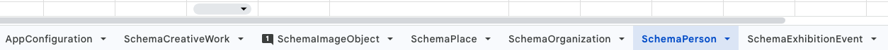
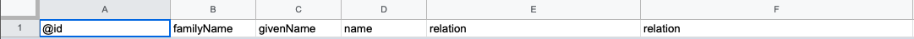
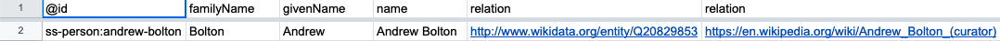
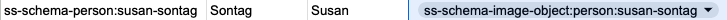
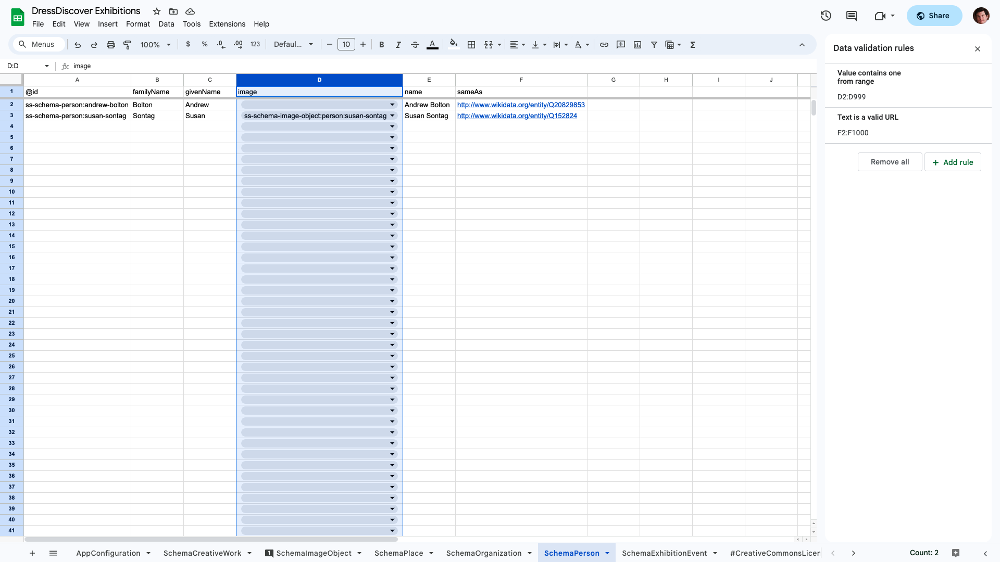
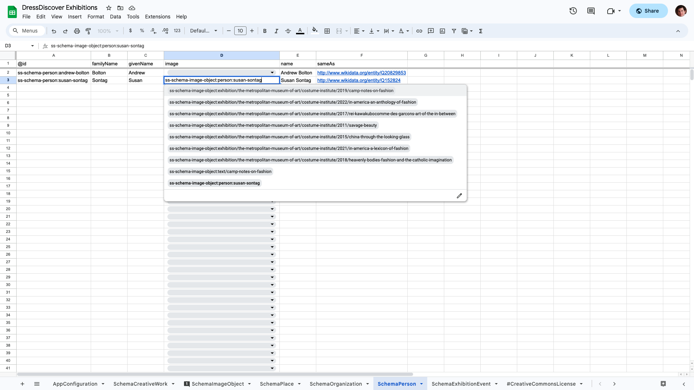

import GoogleSheetsTemplateLink from "@site/src/components/GoogleSheetsTemplateLink";

# Reference: spreadsheet format

This page documents the format of spreadsheets (in Google Sheets, Excel, et al.) for storing Paradicms collection data.


### Spreadsheet structure

A Paradicms-formatted spreadsheet such as the <GoogleSheetsTemplateLink>Google Sheets template</GoogleSheetsTemplateLink> consists of multiple sheets. Each sheet corresponds to a class in one of the [Paradicms logical data models](/docs/reference/logical-data-models), such as `FoafPerson` or `SchemaCreativeWork`, and is named after that class, as in the Google Sheets screenshot below:



Sheets can be named with variants of the class names:
* `SchemaPerson`: the exact class name (camel case) documented in the [logical data models reference](/docs/reference/logical-data-models)
* `schema_person`: snake case variant of the class name
* `schema-person`: spinal case variant of the class name

Sheets with names that start with a `#` are ignored.


### Sheet structure

#### The header row

The first row of each sheet is a header row corresponding to the [JSON-LD terms](https://www.w3.org/TR/json-ld11/#dfn-term) for properties of the class, as well as columns with special meanings in JSON-LD, such as `@id`. The columns can be in any order.

For example, `SchemaPerson` has columns corresponding to the JSON-LD terms `familyName` (for the IRI `https://schema.org/familyName`), `givenName`, and `name`, among others. The full set of properties/terms for each class is listed in the [logical data models reference](/docs/reference/logical-data-models).



Note that the header columns do not have to be unique. Columns with identical headers allow you to enter multiple values for the same property.

Columns with headers that start with a `#` are ignored.

#### Data rows

Any rows after the header row are considered data rows, and correspond to instances of the sheet's class.




### Sheet data

#### The `@id` column

Sheets such as `SchemaCreativeWork` and `SchemaPerson` have an `@id` column. By convention this is the first column in the sheet.

The `@id` column contains a unique identifier that allows data rows in the sheet to be referenced by data rows in another sheet. For example, the `image` column in the `SchemaPerson` sheet should contain the value of an `@id` cell in the `SchemaImage` sheet.

`@id` is a [JSON-LD construct](https://www.w3.org/TR/json-ld11/#node-identifiers). Unique identifiers in the `@id` column must be [Internationalized Resource Identifiers (IRIs)](https://en.wikipedia.org/wiki/Internationalized_Resource_Identifier). Paradicms simplifies the use of IRIs in spreadsheets by providing an IRI namespace per sheet and an associated prefix. You can see this at work in the `SchemaPerson` sheet. The unique identifier (`@id`) of Andrew Bolton is `ss-schema-person:andrew-bolton`. Internally, Paradicms expands the `ss-schema-person:` prefix to something like `urn:paradicms:` so that the result is a well-formed IRI like `urn:paradicms:andrew-bolton`. An `SchemaCreativeWork` data row with a `creator` of Andrew Bolton can simply contain `ss-schema-person:andrew-bolton` in the corresponding cell. You can see this mechanism with the `SchemaPerson` for Susan Sontag referencing a `SchemaImageObject` (`ss-schema-image-object:susan-sontag`) in the `image` column:



#### Other columns

The other columns of a data row correspond to the values of properties of a class instance.  For example, one of the data rows in the `SchemaPerson` sheet corresponds to the person Andrew Bolton. Andrew Bolton has a `familyName` `Andrew` and `givenName` `Bolton`, as in the screenshot below.


#### Data validation

The template Google Sheet contains data validation rules that constrain the contents of certain cells. You can see the rules for the `SchemaPerson` sheet, below.



The rules indicate that the `SchemaPerson` sheet's `image` column (column D in the screenshot) must contain values that exist in the `SchemaImageObject` sheet's `@id` column. In other words, a `SchemaPerson`'s `image` property must refer to the identifier of a `SchemaImageObject`. Google Sheets enforces this rule by showing a dropdown of possible values:



Other rules indicate that cells must have values in a certain format. For example, the `sameAs` column in `SchemaPerson` must be a valid URL.


### Conversion to Linked Data

Once you've entered data into the spreadsheet, Paradicms converts the spreadsheet to Linked Data by converting each data row to [JSON](https://www.json.org/), then interpreting the JSON as [JSON-LD](https://json-ld.org/). Having a high-level understanding of this process will help you take advantage of the power and flexibility of the Paradicms data model.

#### Converting the spreadsheet to JSON

The spreadsheet to JSON conversion process works as follows:

* A data row converts to a JSON object (`{}`).
* Each column header for the row is a key in that object. Columns with identical headers convert multiple values for that key.
* Empty and whitespace-only cells are ignored.
* Non-empty cells in the row are converted to JSON values, attempting to preserve the type wherever possible. The table below shows the conversion process for common types.

| Spreadsheet cell value type | JSON value type                  |
|-----------------------------|----------------------------------|
| Boolean                     | Boolean                          |
| Date                        | ISO 8601 format date string      |
| Date-time                   | ISO 8601 format date-time string |
| Number                      | Number                           |
| String                      | String                           |

A cell can contain arbitrary JSON values, including objects (`{}`) and arrays (`[]`). The conversion process attempts to parse any string cell value as JSON. Strings that can't be parsed as JSON are passed through as-is.

Both Google Sheets and Excel support inserting image data (e.g., a copy of a `.jpg` or `.png`) directly into cells. These are not converted to JSON, but handled specially in the conversion process for `Image` classes. See the [logical data models reference](/docs/reference/logical-data-models) for more information.

Converting the Andrew Bolton spreadsheet row shown above would produce the following JSON:
```json
{
  "@id": "ss-schema-person:andrew-bolton",
  "familyName": "Bolton",
  "givenName": "Andrew",
  "name": "Andrew Bolton",
  "sameAs": "http://www.wikidata.org/entity/Q20829853"
}
```

#### Interpreting the JSON as JSON-LD

Each logical data model class -- and thus each sheet in the spreadsheet -- has an associated [JSON-LD context](https://www.w3.org/TR/json-ld11/#the-context). Paradicms adds this context to the converted JSON (as a `@context` key) before interpreting the latter as JSON-LD. The JSON-LD context maps keys in the JSON object, such as `familyName`, to RDF predicate IRIs, in this case `https://schema.org/familyName`.

The result of this interpretation is a small RDF graph per data row:

```turtle
<urn:spreadsheet:exhibitions:schema-person:andrew-bolton> a schema:Person ;
    owl:sameAs <http://www.wikidata.org/entity/Q20829853> ;
    schema:familyName "Bolton" ;
    schema:givenName "Andrew" ;
    schema:name "Andrew Bolton" .
```

Note that the class (`SchemaPerson`) is also incorporated into the RDF as an `rdf:type` of `schema:Person`.

#### Putting it all together

Converting each data row with this process (row -> JSON, JSON -> RDF) produces a set of RDF graphs, which are merged to form a single large graph representing all the data in the spreadsheet.

Cross-references to `@id` columns between sheets creates links between graphs. The `SchemaPerson` `image` reference shown above produces RDF like the following (abridged for clarity):

```turtle
<urn:spreadsheet:exhibitions:schema-person:susan-sontag> a schema:Person ;
    schema:image <urn:spreadsheet:exhibitions:schema-image-object:person:susan-sontag> .
```
