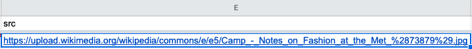

# Tutorial: Edit collection data in a spreadsheet

The tutorial will guide you in editing collection data in a spreadsheet program such as Google Sheets or Excel.

### Before you start

* **Create a spreadsheet.** See below.
* **Review the [Paradicms data model](/docs/introduction/data-model) and [ontology](/docs/reference/ontology).**
* Optionally, **review the [reference documentation on Paradicms-formatted spreadsheets](/docs/reference/spreadsheet-format).**

#### Creating a spreadsheet

For this tutorial you will need a spreadsheet to edit. The easiest way to create one is to follow the [recipe on creating a Google Sheet for collection data](/docs/recipes/create-google-sheet).

You can also create a blank spreadsheet and then fill in the sheets and sheet headers as you go.

The example screenshots will start from a blank spreadsheet. If you are starting from a pre-populated template, you can clear the existing data from it (rows 2 on in every sheet), or simply append new rows.

### Data entry workflow

The remaining sections of this document follow a subset of the [repeatable data entry workflow](/docs/reference/data-entry-workflow). We will not attempt to enter data in every sheet, but only enough to demonstrate the editing process.

### Enter a `Collection`

Enter information about the Costume Institute into a row in the `Collection` sheet.

### Enter a `Person`

Enter information about Andrew Bolton into a row in the `Person` sheet.

Note that we've minted a new unique identifier (an IRI) in the `@id` column using the `ss-person:` namespace prefix. We will reference this later.

### Enter a `Work`

Enter information about the exhibition "Camp: Notes on Fashion" in the `Work` sheet.

#### Enter the `@id` of the new `Work`

We are minting a new `@id` for the `Work`. The `@id` can have any structure, provided it follows IRI rules. You can use a slug generator to convert ("slugify") arbitrary strings ("The Metropolitan Museum of Art") into IRI-friendly slugs (`the-metropolitan-museum-of-art`). There are various slug generators available online; enter "slug generator" into any search engine to find one.

In the above example the `@id` for "Camp: Notes on Fashion" incorporates the type of the `Work` (exhibition) and the name of the hosting institution (the Met) as well as the name of the `Work`. The parts are separated by a `:` and prefixed by `ss-work:` to produce `ss-work:exhibition/the-metropolitan-museum-of-art/costume-institute/camp-notes-on-fashion`.

#### Link the new `Work` to the `Collection` and `Person` created above

The new `Work`'s `collection` column references the `@id` of the `Collection` we created. The `creator` column has the `@id` of the new `Person`.

If you started from the Google Sheets template, the appropriate values should be presented in a dropdown, and you won't have to type them in.

### Enter an `Image`

Enter an `Image` that depicts the `Work` we just created, as shown:

Note that the `Image` sheet has no `@id` column. No other sheets refer to data in `Image`, so it is safe to elide the `@id` column.

Link the new `Image` row to an appropriate `License`:

And reference a URL for retrieving the image:

Alternatively, you can insert an image directly into the `src` cell:

### Next steps

You now have a spreadsheet with data about a `Collection`, `Image`, `License`, `Person`, and `Work`. From here you can enter more data, following the [ontology reference](/docs/reference/ontology), or use the data you've entered to generate a website by following the appropriate [tutorial](/docs/tutorials/spreadsheet-ssg).
