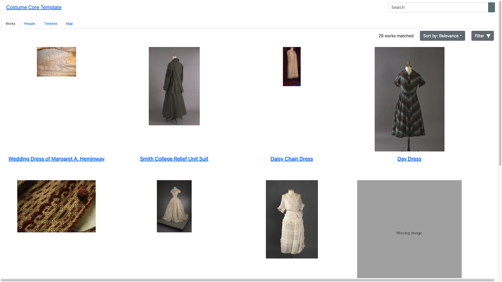

# Tutorial: generate a faceted search interface for a Costume Core-formatted Airtable base

The tutorial will guide you in creating a web-based faceted search interface for a [Costume Core](http://www.ardenkirkland.com/costumecore/)-formatted Airtable base.

You will:
* Generate a website from your Airtable base using [GitHub Actions](https://github.com/features/actions)
* Deploy the site using [GitHub Pages](https://pages.github.com/)

The end result will look like:

### Before you start

For this tutorial you will need:

* A Costume Core-formatted Airtable base derived from the [blank template](https://airtable.com/shrqDSOg29079rbxb). The tutorial will use the [sample dataset](https://airtable.com/shryU3j5IXFxjrdEy).
* A [GitHub account](https://github.com/join) to create a GitHub repository, set up GitHub Actions, and deploy your generated website using GitHub Pages

You do not need to install git or any other software on your computer.

### Find your Airtable API base id

Follow [these instructions](https://support.airtable.com/docs/finding-airtable-ids#finding-ids-in-airtable-api) under the _Finding IDs in Airtable API_ -> _Base IDs_ header.

Your Airtable API base ID should resemble `appgU92SdGTwPIVNg` (which is the ID of the sample dataset). This identifier is specific to the Airtable API, and is not contained in the URL of the base (e.g., `https://airtable.com/shryU3j5IXFxjrdEy/tblUeStXG6w5MMGlF/viwlbQDtd6H80rzVw`).

### Obtain an Airtable personal access token

Follow [these instructions](https://support.airtable.com/docs/creating-and-using-api-keys-and-access-tokens#personal-access-tokens-basic-actions) to obtain a personal access token.

The personal access token should have at least the following scopes:

* `data.records:read`
* `schema.bases:read`

You should limit the token's access to your specific Airtable base.

### Create and configure a GitHub repository

#### Copy the template GitHub repository

Follow [these instructions](https://docs.github.com/en/repositories/creating-and-managing-repositories/creating-a-repository-from-a-template) on creating a GitHub repository from a template, using [this template repository](https://github.com/dressdiscover/costume-core-template).

#### Configure GitHub Pages

Follow [these instructions](https://docs.github.com/en/pages/getting-started-with-github-pages/configuring-a-publishing-source-for-your-github-pages-site#publishing-with-a-custom-github-actions-workflow) on publishing GitHub Pages with a custom GitHub Actions workflow.

#### Configure GitHub Actions

Following [these instructions](https://docs.github.com/en/actions/security-guides/encrypted-secrets#creating-encrypted-secrets-for-a-repository), create new repository secrets with the following names and values:

* `AIRTABLE_ACCESS_TOKEN`: the Airtable personal access token you obtained in the step above
* `AIRTABLE_BASE_ID`: the Airtable API base ID you obtained in the step above

### Generate the site

Follow the [recipe on manually running a GitHub Actions workflow](/docs/recipes/run-github-ssg-workflow).

The GitHub Actions workflow is downloading the contents of the Google Sheet, transforming it to the Paradicms data model, generating the faceted search interface, and deploying it to GitHub Pages.

### Navigate to your site

Follow the [recipe on visiting your GitHub Pages site](/docs/recipes/visit-github-pages).

Your site is now available on the public Internet, and you can share it with people.

