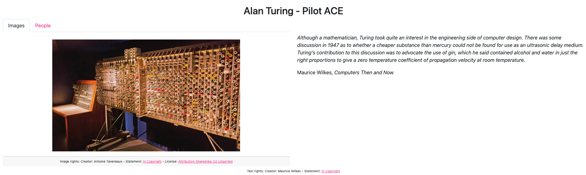

# Tutorial: generate a digital exhibition from files in a GitHub repository

The tutorial will guide you in creating a web-based digital exhibition from files in a GitHub repository.

You will:
* Define the contents of your exhibition using files arranged in a prescribed directory structure
* Generate a website for the exhibition using [GitHub Actions](https://github.com/features/actions)
* Deploy the site using [GitHub Pages](https://pages.github.com/)

The end result will look like:

### Before you start

For this tutorial you will need:

* A [GitHub account](https://github.com/join) to create a GitHub repository, set up GitHub Actions, and deploy your generated website using GitHub Pages

You do not need to install git or any other software on your computer.

### Create and configure a GitHub repository

#### Copy the template GitHub repository

Follow [these instructions](https://docs.github.com/en/repositories/creating-and-managing-repositories/creating-a-repository-from-a-template) on creating a GitHub repository from a template, using [this template repository](https://github.com/minorg/ComputerScienceInventions).

#### Configure GitHub Pages

Follow [these instructions](https://docs.github.com/en/pages/getting-started-with-github-pages/configuring-a-publishing-source-for-your-github-pages-site#publishing-with-a-custom-github-actions-workflow) on publishing GitHub Pages with a custom GitHub Actions workflow.

### Generate the site

Follow the [recipe on manually running a GitHub Actions workflow](/docs/recipes/run-github-ssg-workflow).

The GitHub Actions workflow is transforming files in the repository to the Paradicms data model, generating the digital exhibition website, and deploying it to GitHub Pages.

### Navigate to your site

Follow the [recipe on visiting your GitHub Pages site](/docs/recipes/visit-github-pages).

Your site is now available on the public Internet, and you can share it with people.

### Next steps

Your new GitHub repository contains example data copied from the template. When you are ready, proceed to the tutorial on [editing file-based collection data](/docs/tutorials/edit-markdown).
