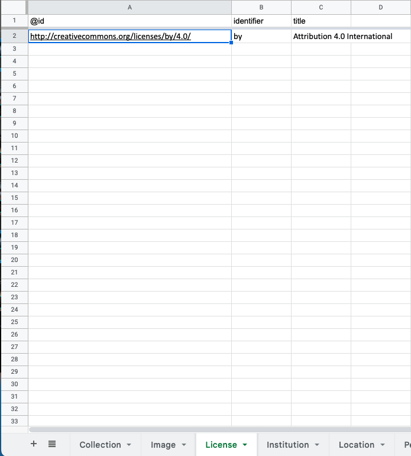
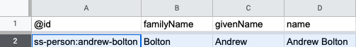
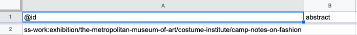
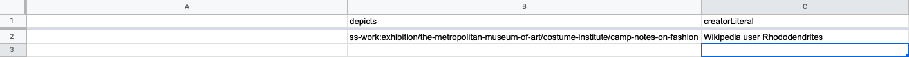
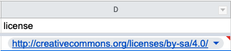

# Tutorial: Edit collection data in a spreadsheet

The tutorial will guide you in editing collection data in a spreadsheet program such as Google Sheets or Excel.

### Before you start

* **Create a spreadsheet.** See below.
* **Review the [Paradicms data model](../introduction/data-model).**
* Optionally, **review the [reference documentation on Paradicms-formatted spreadsheets](../reference/spreadsheet-format).**

#### Creating a spreadsheet

For this tutorial you will need a spreadsheet to edit. The easiest way to create one is to follow the [recipe on creating a Google Sheet for collection data](../recipes/create-google-sheet).

You can also create a blank spreadsheet and then fill in the sheets and sheet headers as you go.

The example screenshots will start from a blank spreadsheet. If you are starting from a pre-populated template, you can clear the existing data from it (rows 2 on in every sheet), or simply append new rows.

### Data entry workflow

The remaining sections of this section will follow a subset of the [repeatable data entry workflow](../reference/data-entry-workflow) described in the reference section. We will not attempt to enter data in every sheet, but only enough to demonstrate the editing process.

### Enter a `License`

Enter one of the standard [Creative Commons](https://creativecommons.org/) licenses in the `License` sheet. Here we've entered data about the "Attribution 4.0 International" license (BY 4.0):

Since Creative Commons licenses have their own unique identifiers (IRIs, e.g., `http://creativecommons.org/licenses/by/4.0/`), we put the established IRI in the `@id` column instead of minting our own `ss-license:`-prefixed IRI.

### Enter an `Institution`

Enter information about The Metropolitan Museum of Art in the `Institution` sheet.

### Enter a `Person`

Enter information about Andrew Bolton into a row in the `Person` sheet.

Note that we've minted a new unique identifier (an IRI) in the `@id` column using the `ss-person:` namespace prefix. We will reference this later.

### Enter a `Work`

Enter information about the exhibition "Camp: Notes on Fashion" in the `Work` sheet.

#### Enter the `@id` of the new `Work`

We are minting a new `@id` for the `Work`. The `@id` can have any structure, provided it follows IRI rules. You can use a slug generator to convert ("slugify") arbitrary strings ("The Metropolitan Museum of Art") into IRI-friendly slugs (`the-metropolitan-museum-of-art`). There are various slug generators available online; enter "slug generator" into any search engine to find one.

In the above example the `@id` for "Camp: Notes on Fashion" incorporates the type of the `Work` (exhibition) and the name of the hosting institution (the Met) as well as the name of the `Work`. The parts are separated by a `:` and prefixed by `ss-work:` to produce `ss-work:exhibition/the-metropolitan-museum-of-art/costume-institute/camp-notes-on-fashion`.

#### Link the new `Work` to the `Collection`, `Institution`, and `Person` created above

The new `Work`'s `collection` column references the `@id` of the `Collection` we created. The `creator` column has the `@id` of the new `Person`. The `institution` column has the `@id` of the new `Institution`.

If you started from the Google Sheets template, the appropriate values should be presented in a dropdown, and you won't have to type them in.

### Enter an `Image`

Enter an `Image` that depicts the `Work` we just created, as shown:

Note that the `Image` sheet has no `@id` column. No other sheets refer to data in `Image`, so it is safe to elide the `@id` column.

Link the new `Image` row to an appropriate `License`:

And reference a URL for retrieving the image:

### Next steps

You now have a spreadsheet with data about a `License`, `Institution`, `Collection`, `Work`, and `Image`. From here you can enter more data, following the [data model reference](../reference/data-model), or use the data you've entered to generate a website by following the appropriate [tutorial](./google-sheets-ssg).

