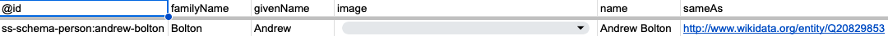
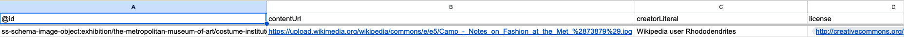
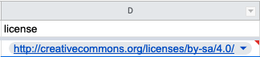
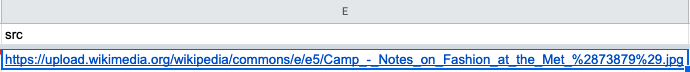
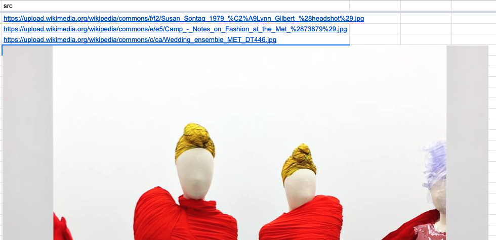
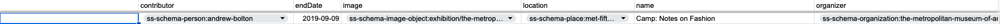

# Tutorial: Edit collection data in a spreadsheet

The tutorial will guide you in editing collection data in a spreadsheet program such as Google Sheets or Excel.

### Before you start

* **Create a spreadsheet.** See below.
* **Review the [Paradicms conceptual data model](/docs/introduction/conceptual-data-model) and [logical data models](/docs/reference/logical-data-models).**
* Optionally, **review the [reference documentation on Paradicms-formatted spreadsheets](/docs/reference/spreadsheet-format).**

#### Creating a spreadsheet

For this tutorial you will need a spreadsheet to edit. The easiest way to create one is to follow the [recipe on creating a Google Sheet for collection data](/docs/recipes/create-google-sheet).

You can also create a blank spreadsheet and then fill in the sheets and sheet headers as you go.

The example data will start from a blank spreadsheet. If you are starting from a pre-populated template, you can clear the existing data from it (rows 2 on in every sheet), or simply append new rows.

### Data entry workflow

The remaining sections of this document follow a subset of the [repeatable data entry workflow](/docs/reference/data-entry-workflow). We will not attempt to enter data in every sheet, but only enough to demonstrate the editing process.

### Enter a `Person`

Enter information about Andrew Bolton into a row in the `SchemaPerson` sheet.

Note that we've minted a new unique identifier (an IRI) in the `@id` column using the `ss-schema-person:` namespace prefix. We will reference this later.

### Enter an `Image`

Enter an `Image` for "Camp: Notes on Fashion" in the `SchemaImageObject` sheet.

Note that the `SchemaImageObject` sheet has no `@id` column. No other sheets refer to data in `Image`, so it is safe to elide the `@id` column.

Link the new `SchemaImageObject` row to an appropriate `License`:

And reference a URL for retrieving the image:

Alternatively, you can insert an image directly into the `src` cell:

### Enter an `Event`

Enter information about the exhibition "Camp: Notes on Fashion" in the `SchemaExhibitionEvent` sheet.

#### Link the new `Event` to the `Image` and `Person` created above

The new `Event`'s `image` column references the `@id` of the `Image` we created. The `organizer` column has the `@id` of the new `Person`.

If you started from the Google Sheets template, the appropriate values should be presented in a dropdown, and you won't have to type them in.

### Next steps

You now have a spreadsheet with data about an `Event`, `Image`, and `Person`. From here you can enter more data, following the [logical data models reference](/docs/reference/logical-data-models), or use the data you've entered to generate a website by following the appropriate [tutorial](/docs/tutorials/spreadsheet-ssg).
