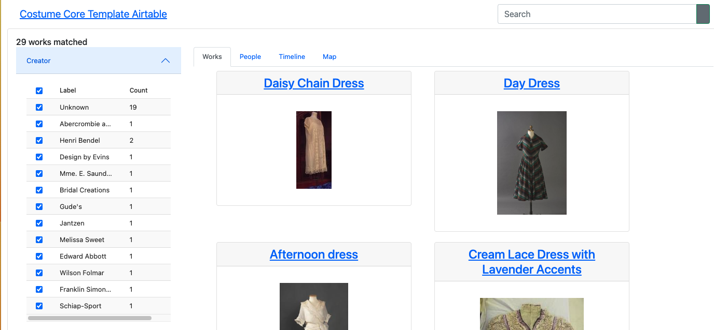
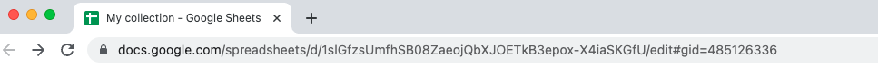
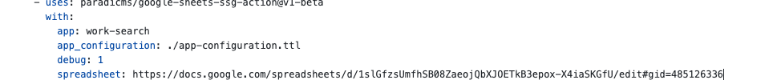

# Tutorial: generate a faceted search interface for data in Google Sheets

The tutorial will guide you in creating a web-based faceted search interface for your collection data.

You will:
* Enter collection metadata/data in [Google Sheets](https://www.google.com/sheets/about/)
* Generate a website from the collection data using [GitHub Actions](https://github.com/features/actions)
* Deploy the site using [GitHub Pages](https://pages.github.com/)

The end result will look like:

### Before you start

For this tutorial you will need:

* A [Google account](https://support.google.com/accounts/answer/27441?hl=en) to access Google Sheets
* A [GitHub account](https://github.com/join) to create a GitHub repository, set up GitHub Actions, and deploy your generated website using GitHub Pages

You do not need to install git or any other software on your computer.

### Create and configure a Google Sheet

Follow the [recipe on creating a Google Sheet for collection data](../recipes/create-google-sheet).

### Create and configure a GitHub repository

#### Copy the template GitHub repository

Follow the [recipe on creating a GitHub repository from a template](../recipes/create-github-repository), using [this template repository](https://github.com/dressdiscover/exhibitions).

#### Configure GitHub Pages

Follow the [recipe on configuring GitHub Pages](../recipes/configure-github-pages).

#### Configure the Paradicms app

Edit the Paradicms app configuration on GitHub, [following the recipe](../recipes/edit-paradicms-app-configuration-on-github).

On the `app-configuration.ttl` editing screen, change the basePath to `/` and the name of your GitHub repository. For example, if your repository is named `my-collection`, your `basePath` should be `"/my-collection"`.

#### Configure GitHub Actions

Find the URL of your Google Sheet in the address bar of your browser tab. It will start with `docs.google.com`.

[Follow the recipe](../recipes/edit-github-ssg-workflow) to edit the GitHub Actions workflow configuration.

In the editor, change the `spreadsheet` value to the URL of your spreadsheet.

When you're done, commit changes by following the editing recipe.

## Generate the site

Follow the [recipe on manually running a GitHub Actions workflow](../recipes/run-github-ssg-workflow).

## Navigate to your site

Follow the [recipe on visiting your GitHub Pages site](../recipe/visit-github-pages).

## Next steps

Your new Google Sheet contains example collection data copied from teh template. When you are ready, clear this data (rows 2+) in each sheet, and proceed to the tutorial on [editing collection data in a spreadsheet](./edit-spreadsheet).
