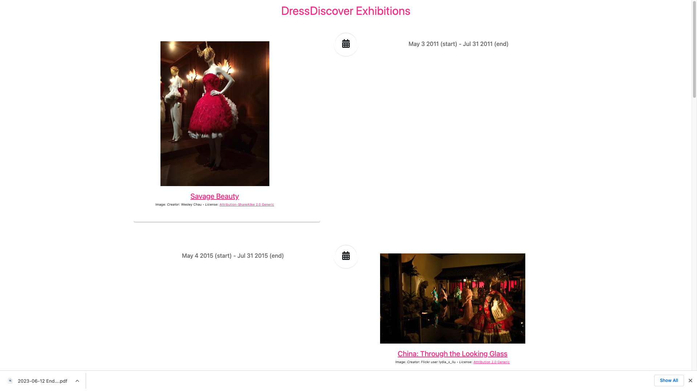
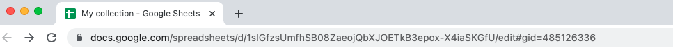

# Tutorial: generate a faceted search interface for data in Google Sheets

The tutorial will guide you in creating a web-based faceted search interface for your collection data.

You will:
* Create a [Google Sheet](https://www.google.com/sheets/about/) for storing collection data
* Generate a website from the collection data using [GitHub Actions](https://github.com/features/actions)
* Deploy the site using [GitHub Pages](https://pages.github.com/)

The end result will look like:




### Before you start

For this tutorial you will need:

* A [Google account](https://support.google.com/accounts/answer/27441?hl=en) to access Google Sheets
* A [GitHub account](https://github.com/join) to create a GitHub repository, set up GitHub Actions, and deploy your generated website using GitHub Pages

You do not need to install git or any other software on your computer.


### Create and configure a Google Sheet

Follow the [recipe on creating a Google Sheet for collection data](/docs/recipes/create-google-sheet).


### Create and configure a GitHub repository

#### Copy the template GitHub repository

Follow the [recipe on creating a GitHub repository from a template](/docs/recipes/create-github-repository), using [this template repository](https://github.com/dressdiscover/exhibitions).

You'll be using GitHub to:

* automate the process of building the app from the Google Sheet, using GitHub Actions
* serve the statically-generated files (CSS, HTML, JavaScript) of the faceted search app, using GitHub Pages


#### Configure GitHub Pages

Follow the [recipe on configuring GitHub Pages](/docs/recipes/configure-github-pages).


#### Configure GitHub Actions

Find the URL of your Google Sheet in the address bar of your browser tab. It will start with `docs.google.com`.



[Follow the recipe](/docs/recipes/edit-github-ssg-workflow) to edit the GitHub Actions workflow configuration.

In the editor, change the `spreadsheet` input to the `spreadsheet-ssg-action` to the URL of your spreadsheet:

```yaml
uses: paradicms/spreadsheet-ssg-action@v1-beta
with:
  spreadsheet: "https://docs.google.com/spreadsheets/d/1j2oaMvMxY4pnXO-sEH_fky2R2gm6TQeIev_Q8rVOD4M/edit#gid=0"
```

When you're done, commit changes by following the editing recipe.

### Generate the site

Follow the [recipe on manually running a GitHub Actions workflow](/docs/recipes/run-github-ssg-workflow).

The GitHub Actions workflow is downloading the contents of the Google Sheet, transforming it to the Paradicms data model, generating the faceted search interface, and deploying it to GitHub Pages.

### Navigate to your site

Follow the [recipe on visiting your GitHub Pages site](/docs/recipes/visit-github-pages).

Your site is now available on the public Internet, and you can share it with people.

### Next steps

Your new Google Sheet contains example collection data copied from the template. When you are ready, proceed to the tutorial on [editing collection data in a spreadsheet](/docs/tutorials/edit-spreadsheet).
