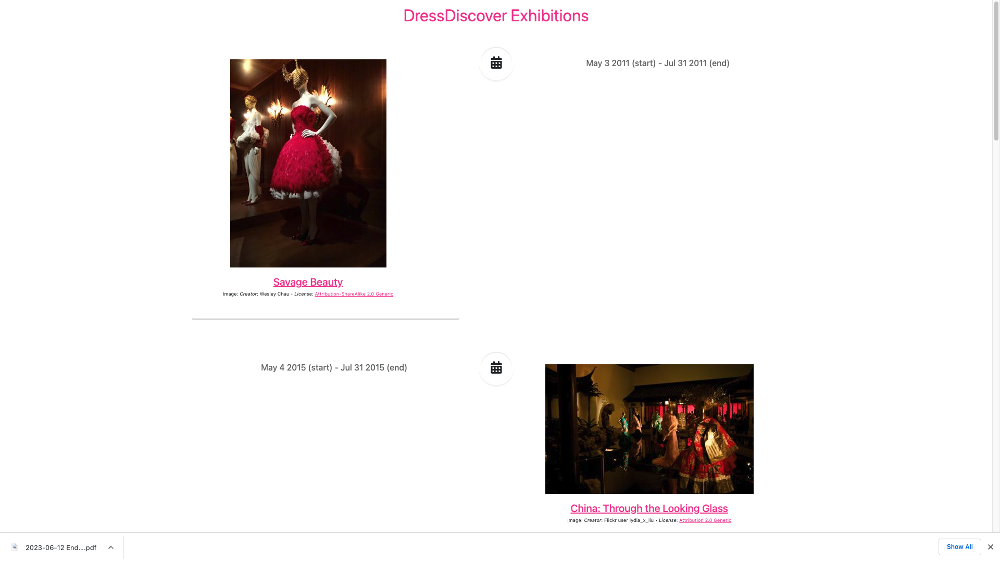
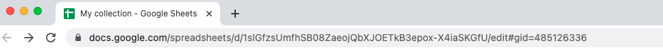

import GoogleSheetsGitHubTemplateRepositoryLink from "@site/src/components/GoogleSheetsGitHubTemplateRepositoryLink";

# Tutorial: generate a timeline interface for data in Google Sheets

The tutorial will guide you in creating a web-based faceted search interface for collection data in Google Sheets.

You will:
* Create a [Google Sheet](https://www.google.com/sheets/about/) for storing collection data
* Generate a website from the collection data using [GitHub Actions](https://github.com/features/actions)
* Deploy the site using [GitHub Pages](https://pages.github.com/)

The end result will look like:

### Before you start

For this tutorial you will need:

* A [Google account](https://support.google.com/accounts/answer/27441?hl=en) to access Google Sheets
* A [GitHub account](https://github.com/join) to create a GitHub repository, set up GitHub Actions, and deploy your generated website using GitHub Pages

You do not need to install git or any other software on your computer.

### Create and configure a Google Sheet

Follow the [recipe on creating a Google Sheet for collection data](/docs/recipes/create-google-sheet).

### Create and configure a GitHub repository

#### Copy the template GitHub repository

Follow [these instructions](https://docs.github.com/en/repositories/creating-and-managing-repositories/creating-a-repository-from-a-template) on creating a GitHub repository from a template, using <GoogleSheetsGitHubTemplateRepositoryLink>this template repository</GoogleSheetsGitHubTemplateRepositoryLink>.

#### Configure GitHub Pages

Follow [these instructions](https://docs.github.com/en/pages/getting-started-with-github-pages/configuring-a-publishing-source-for-your-github-pages-site#publishing-with-a-custom-github-actions-workflow) on publishing GitHub Pages with a custom GitHub Actions workflow.

#### Configure GitHub Actions

Find the URL of your Google Sheet in the address bar of your browser tab. It will start with `docs.google.com`.

Following [these instructions](https://docs.github.com/en/actions/security-guides/encrypted-secrets#creating-encrypted-secrets-for-a-repository), create a new repository secret with the name `SPREADSHEET`. The value should be the URL of your spreadsheet.

### Generate the site

Follow the [recipe on manually running a GitHub Actions workflow](/docs/recipes/run-github-ssg-workflow).

The GitHub Actions workflow is downloading the contents of the Google Sheet, transforming them to the Paradicms data model, generating the faceted search interface, and deploying it to GitHub Pages.

### Navigate to your site

Follow the [recipe on visiting your GitHub Pages site](/docs/recipes/visit-github-pages).

Your site is now available on the public Internet, and you can share it with people.

### Next steps

Your new Google Sheet contains example collection data copied from the template. When you are ready, proceed to the tutorial on [editing collection data in a spreadsheet](/docs/tutorials/edit-spreadsheet).
